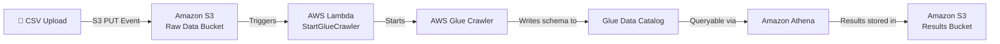
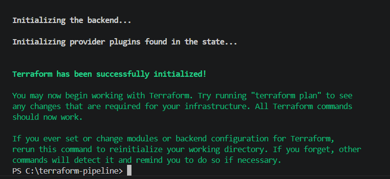
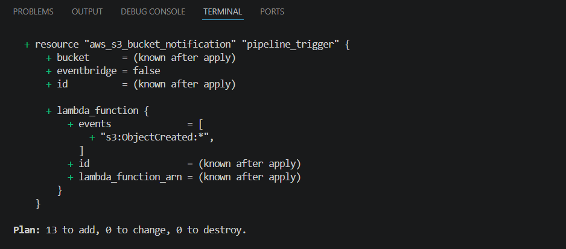
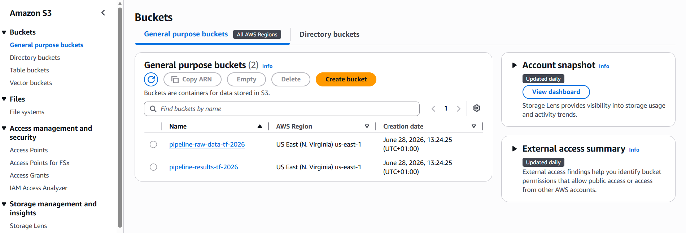
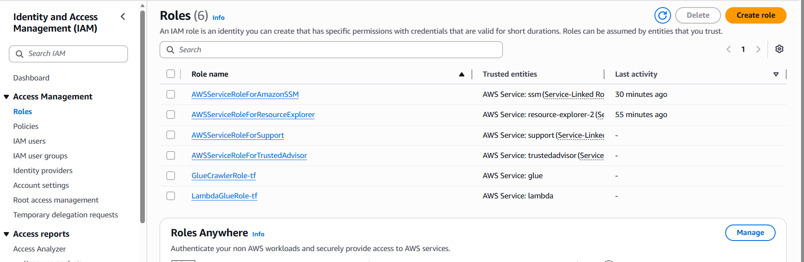
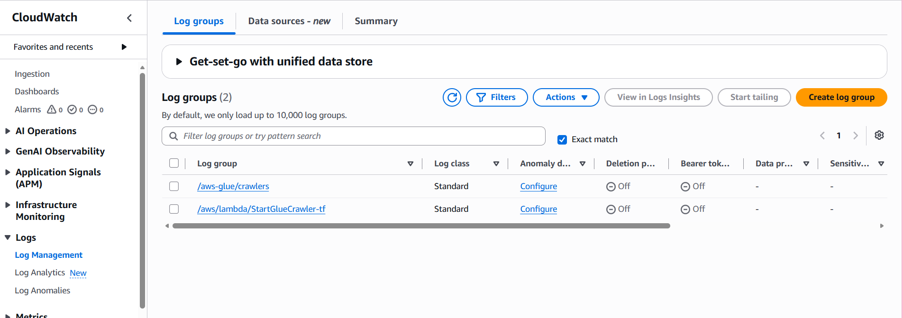
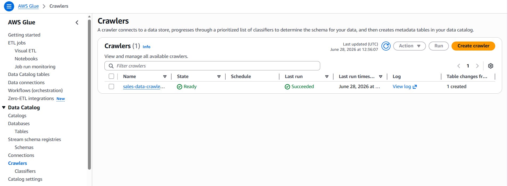
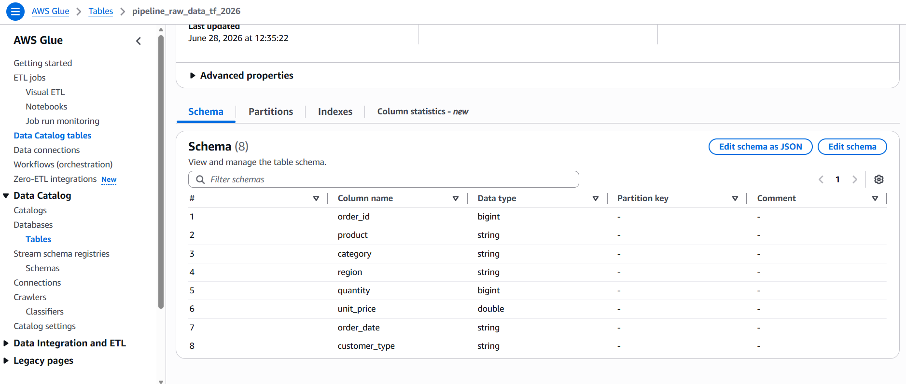

# Terraform — AWS Serverless Data Pipeline (Infrastructure as Code)


A fully automated, event-driven data pipeline on AWS — provisioned entirely with Terraform. Instead of clicking through the AWS Console, every resource is defined as code: S3 buckets, IAM roles, a Lambda function, a Glue Crawler, and the S3 event trigger that connects them — all created with a single `terraform apply` command and destroyed with `terraform destroy`.

> **"Infrastructure that used to take hours of clicking through the console now takes one command."**

---

## Architecture



---

## What Terraform Provisions

| Terraform Resource | AWS Service | Purpose |
|---|---|---|
| `aws_s3_bucket` (×2) | Amazon S3 | Raw data uploads + Athena query results |
| `aws_iam_role` (×2) | AWS IAM | Execution roles for Lambda and Glue |
| `aws_iam_role_policy_attachment` (×4) | AWS IAM | Managed policy attachments |
| `aws_lambda_function` | AWS Lambda | Triggered by S3, starts the Glue Crawler |
| `aws_glue_catalog_database` | AWS Glue | Metadata database |
| `aws_glue_crawler` | AWS Glue | Scans S3, detects schema, registers table |
| `aws_lambda_permission` | AWS Lambda | Allows S3 to invoke Lambda |
| `aws_s3_bucket_notification` | Amazon S3 | Fires Lambda on every CSV upload |

**Total: 13 resources provisioned by one `terraform apply`**

---

## Project Structure

```
terraform-aws-serverless-data-pipeline/
├── provider.tf          # AWS + archive provider configuration
├── main.tf              # All 13 AWS resources defined as code
├── lambda_function.py   # Python code for the Lambda function
└── .gitignore           # Excludes state files and .terraform/ folder
```

---

## How to Use This Project

### Prerequisites
- [Terraform installed](https://developer.hashicorp.com/terraform/install) (AMD64 for Windows)
- [AWS CLI installed](https://aws.amazon.com/cli/) and configured (`aws configure`)
- An AWS IAM user with AdministratorAccess

### Deploy the Pipeline

```bash
# 1. Clone the repo
git clone https://github.com/rukkylatunde2001/terraform-aws-serverless-data-pipeline.git
cd terraform-aws-serverless-data-pipeline

# 2. Initialise Terraform (downloads AWS and archive providers)
terraform init

# 3. Preview what will be created
terraform plan

# 4. Build all 13 resources in AWS
terraform apply
```

### Destroy Everything

```bash
terraform destroy
```

All 13 resources are deleted cleanly. No manual cleanup required.

---

## How It Was Built — Step by Step

### Step 1 — Configure the AWS Provider

Created `provider.tf` to declare the AWS and archive providers, locking the AWS provider to version `~> 5.0` and setting the region to `us-east-1`.

Ran `terraform init` to download both providers and initialise the working directory.



---

### Step 2 — Define All Resources in main.tf

All 13 resources were written in `main.tf`, grouped by service:

- **S3 buckets** — one for raw CSV uploads (`pipeline-raw-data-tf-2026`), one for Athena query results (`pipeline-results-tf-2026`). Both include `force_destroy = true` so `terraform destroy` can empty and delete them automatically.

- **IAM roles** — `LambdaGlueRole-tf` trusted by `lambda.amazonaws.com` with `AWSLambdaBasicExecutionRole` and `AWSGlueConsoleFullAccess` attached. `GlueCrawlerRole-tf` trusted by `glue.amazonaws.com` with `AWSGlueServiceRole` and `AmazonS3ReadOnlyAccess` attached.

- **Lambda function** — `StartGlueCrawler-tf` using Python 3.12. The `archive_file` data source automatically zips `lambda_function.py` so no manual zipping is needed.

- **Glue** — a Glue Data Catalog database (`sales-pipeline-db-tf`) and a Crawler (`sales-data-crawler-tf`) pointed at the raw data S3 bucket.

- **S3 event trigger** — an `aws_lambda_permission` granting S3 the right to invoke Lambda, and an `aws_s3_bucket_notification` that fires on every `s3:ObjectCreated:*` event.

---

### Step 3 — terraform apply

After reviewing the plan (`13 to add, 0 to change, 0 to destroy`), ran `terraform apply` and confirmed with `yes`.



---

### Step 4 — Verify S3 Buckets in AWS Console

Both S3 buckets appeared in the AWS Console immediately after apply — confirming Terraform created them with the correct names and settings.



---

### Step 5 — Verify IAM Roles in AWS Console

Both IAM roles (`LambdaGlueRole-tf` and `GlueCrawlerRole-tf`) were created with the correct trust policies and all four managed policy attachments.



---

### Step 6 — Test the Pipeline End-to-End

Uploaded a CSV file to `pipeline-raw-data-tf-2026`. The S3 PUT event fired Lambda automatically. Lambda started the Glue Crawler, which scanned the bucket and registered the table schema in the Glue Data Catalog.

CloudWatch Logs confirmed the Lambda function executed successfully and the crawler was triggered.



---

### Step 7 — Glue Crawler Created the Table

After the crawler ran, the Glue Data Catalog showed **1 table created** — confirming the CSV schema was detected and registered automatically.



---

### Step 8 — Table Schema Verified

The Glue table `pipeline_raw_data_tf_2026` showed all 8 columns correctly inferred from the CSV headers — `order_id`, `product`, `category`, `region`, `quantity`, `unit_price`, `order_date`, `customer_type`.

The data is now queryable directly from Amazon Athena with no additional setup.



---

## Key Lessons — Why IaC Over Console Clicking

| Console Approach | Terraform Approach |
|---|---|
| Click through 8+ services manually | One `terraform apply` command |
| No record of what settings were used | Every setting documented in `.tf` files |
| Cannot be shared or repeated reliably | Anyone can clone the repo and deploy identically |
| Manual cleanup, easy to forget resources | `terraform destroy` removes everything cleanly |
| Hard to update one setting across all environments | Change one value, apply across all environments |

---

## Troubleshooting

**`BucketAlreadyExists` on apply**
S3 bucket names are globally unique. Rename the bucket in `main.tf` to include your name — e.g. `rukayat-pipeline-raw-2026`.

**`Policy does not exist or is not attachable`**
The policy ARN is wrong. For the Lambda Glue attachment use `arn:aws:iam::aws:policy/AWSGlueConsoleFullAccess` — not `AWSGlueServiceRole`.

**`Machine Type Mismatch` when running terraform**
You downloaded the wrong Terraform binary. Re-download the **AMD64** version from [developer.hashicorp.com/terraform/install](https://developer.hashicorp.com/terraform/install).

**`terraform destroy` fails with BucketNotEmpty**
Add `force_destroy = true` to both `aws_s3_bucket` resources, run `terraform apply`, then `terraform destroy`.

**Glue Crawler creates 0 tables**
The `AmazonS3ReadOnlyAccess` policy is missing from the Glue role. Add the `aws_iam_role_policy_attachment` for it and run `terraform apply`.

---

## About the Author

**Rukayat Alarape**
Data Analyst | Cloud Engineer Learner | Program Officer, University of Ibadan

- GitHub: [@rukkylatunde2001](https://github.com/rukkylatunde2001)
- Email: rukkylatunde2001@gmail.com
